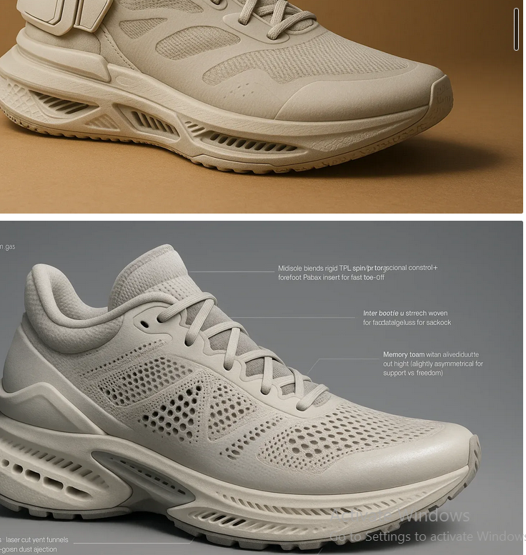

  

# 🧠 CONCEPT AUTOMATION — Future of Footwear Design

## TL;DR  
**Concept Automation** is a modular system that automates the entire footwear concept design process — from emotional persona mapping to high-fidelity sketch outputs — using generative models and design logic. Built for designers who think in systems, not strokes.

---

##  THE PROBLEM  
Footwear design is broken.

- It's manual, slow, and subjective  
- Most ideas never make it to sketch, let alone prototyping  
- Teams are bottlenecked by human  inconsistent taste, and creative fatigue  

In an era where speed and scale win, this old model is a liability.

##  THE ORIGIN  
From the age of 4, I could sit for 5–6 hours straight drawing,eat something and go to the next hours of drawing until 10pm.

I thought that meant I should go to art school.  
Spoiler: **huge mistake**. What I really loved wasn't drawing — it was **breaking down how design works**.

After 4 years in the creative industry, I realized the truth:  
**I’m not an artist. I’m a systems thinker trapped in design.**

That insight created Concept Automation.

---

## ⚙️ WHAT THIS IS  
> A self-evolving design engine that replicates a designer’s conceptual thought process and generates footwear concepts at scale — while keeping the human in the loop for high-leverage decisions only.

---

## 🔍 HOW IT WORKS  
Concept Automation reverse-engineers a designer’s mental model using modular logic blocks.
---

### **Step-by-step breakdown (see flowchart):**

1. **Input Persona & Archetype**  
   Define the emotional driver and performance intent of the shoe.  
   Who is it for? What’s their story?

2. **Decompose Design Logic**  
   Map terrain, friction points, symbolic references, and environmental needs.

3. **Synthesize & Mirror Opposites**  
   Combine tension and harmony, chaos and control — to create narrative depth.

4. **Build Design System Architecture**  
   - Silhouettes mapped to use-cases  
   - Materials selected based on context  
   - Subcultural references injected  
   - Style story + narrative prompts auto-generated

5. **Sketch Concepts in Parallel**  
   Generate a full range of visual outputs:
   - Quick sketches  
   - Firefly-enhanced details  
   - Functional design sketches  

6. **Test & Validate**  
   - Does the design match the persona?  
   - Is the story coherent?  
   - Can it be manufactured?

7. **Final Output**  
   - Ready-to-use visual concepts  
   - Style guides  
   - Prototyping-ready packages  

---
### OUTPUTS

##  WHY THIS WORKS  
Because it’s not “AI for design” — it’s **Design Logic as Code**.

- **Automates creative throughput**, not creativity itself  
- **Inverts the bottleneck** — human input is used only for validation and strategic edits  
- **Simulates intuition** using persona-emotion-material mapping  
- **Optimized for iteration**: you get 100 good ideas, not 3 forced ones  

---

##  WHO THIS IS FOR  
- Concept teams building at scale  
- Product designers tired of manual sketch fatigue  
- Innovation labs experimenting with generative pipelines  
- Visionaries who understand that design is data  

---

## 🛠 TOOLS USED  
- Image Model Integration: Firefly for detail manipulation,Sora, 
- Prompt-based sketching: Text-to-concept ,chatgpt,local mistral asystent
- Systemic Flow: Custom process flowcharting (attached)  
- Outputs: PNG/JPG sketches, prompts, narrative story PDFs  

---

## 📈 FUTURE ROADMAP  
- Integrate ML feedback loops from real user fit data  
- Plug into PLM (Product Lifecycle Management) tools  
- Dynamic drops based on trend AI + automated sketching  
- Voice prompt-driven design pipelines  

---

## ✅ STATUS: Working Prototype  
Concept System is currently producing design sketch variations and working with Firefly-enhanced models for final detailing.

---

## 💥 FINAL WORD  
This isn't a design tool. It's a **creative infrastructure engine**.  
What Figma did for UI, this does for footwear.  
Not a plugin. A **new "system"** for how design happens.

---

## 🔥 CALL TO ACTION  
If you're a brand, lab, or designer thinking 5 years ahead —  
**DM me. 
 Let’s plug this into your team and break the bottleneck for good.**

